# Uber
An entire rebuild, and implementation of ride flow and some screens of Uber.

### Note ⚙️
The application was built using: 
* Xcode 14.3
* Swift 5.8
* macOS Ventura 13.2

### Core Technologies 📲
* Swift
* UIKit (Programmatic approach)
* Protocol Delegation
* Firebase Authentication
* Firebase RealTime Database
* MapKit
* Cosmos (third party)

# Screenshots

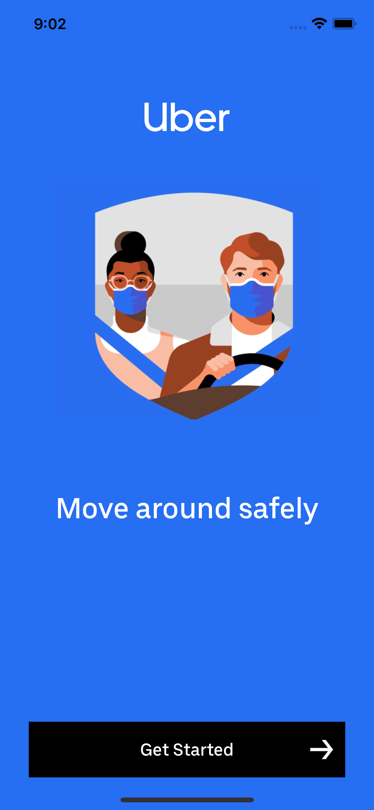
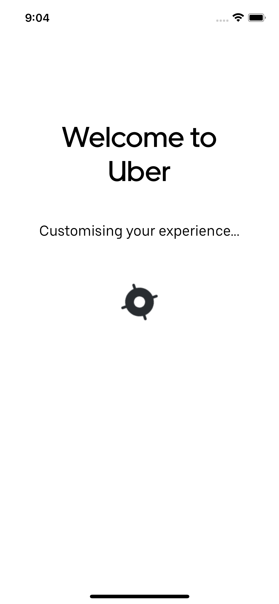

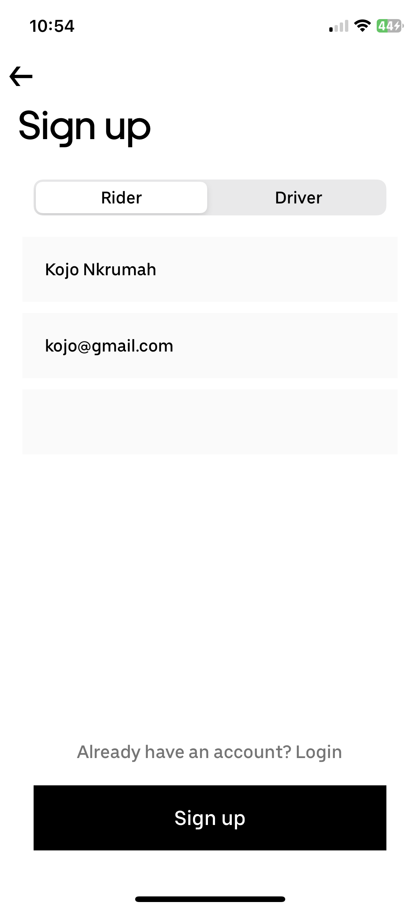
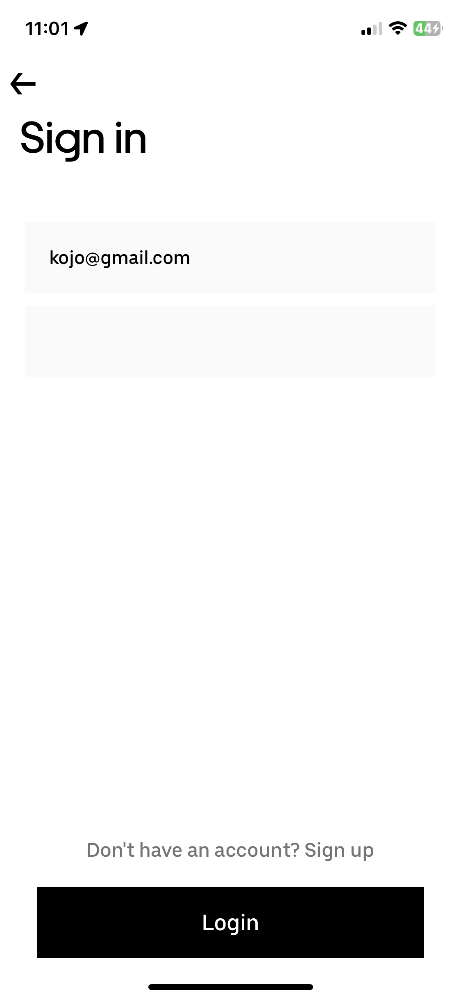
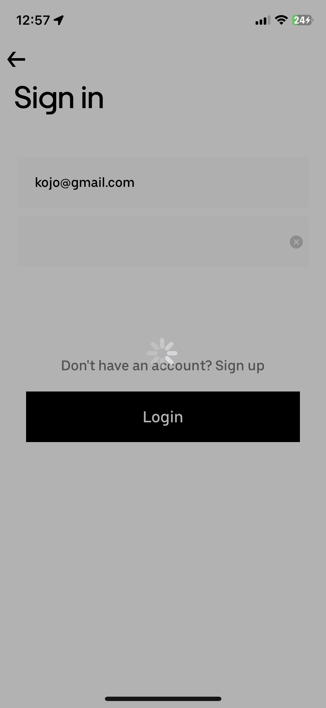

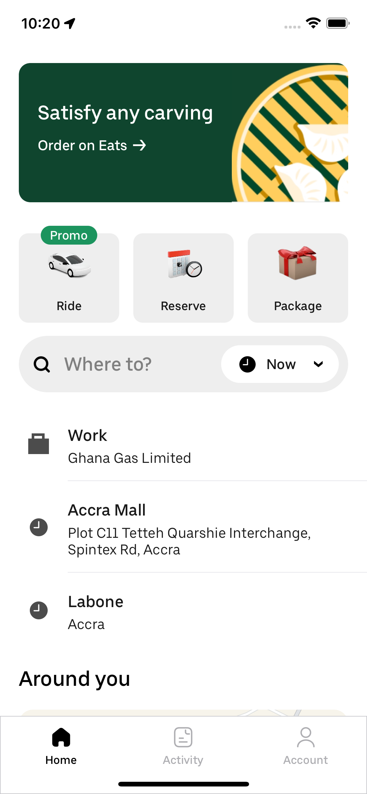
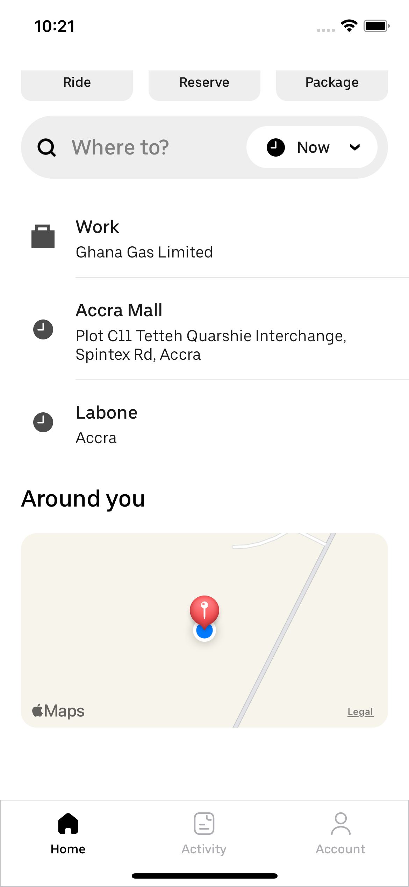
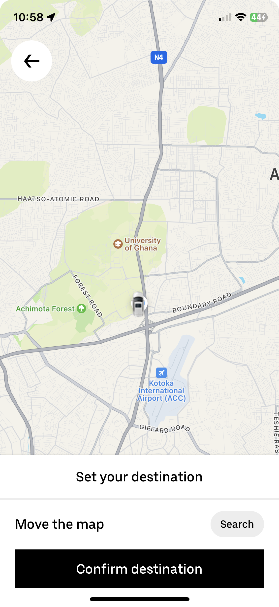

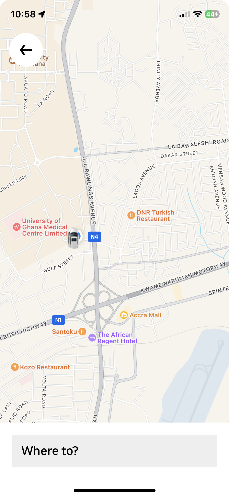
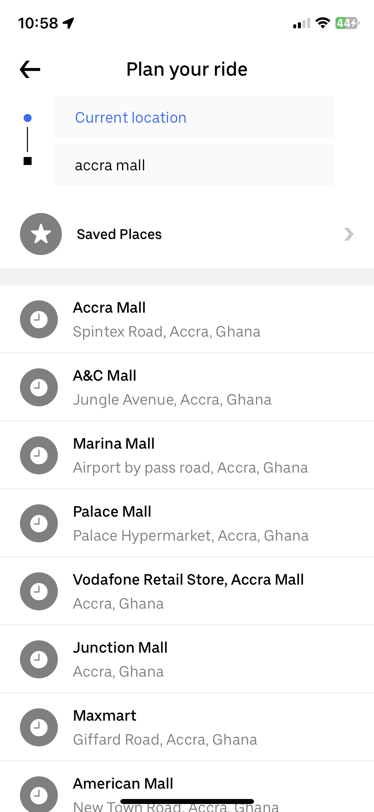
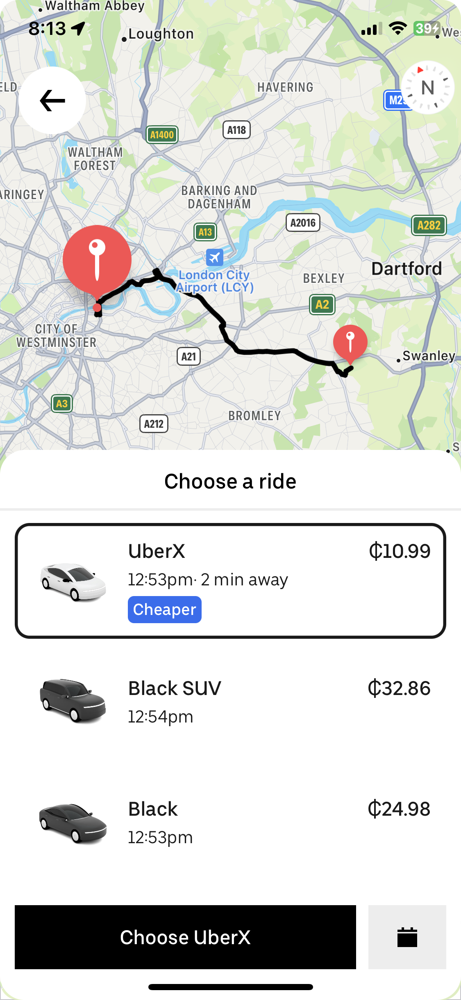

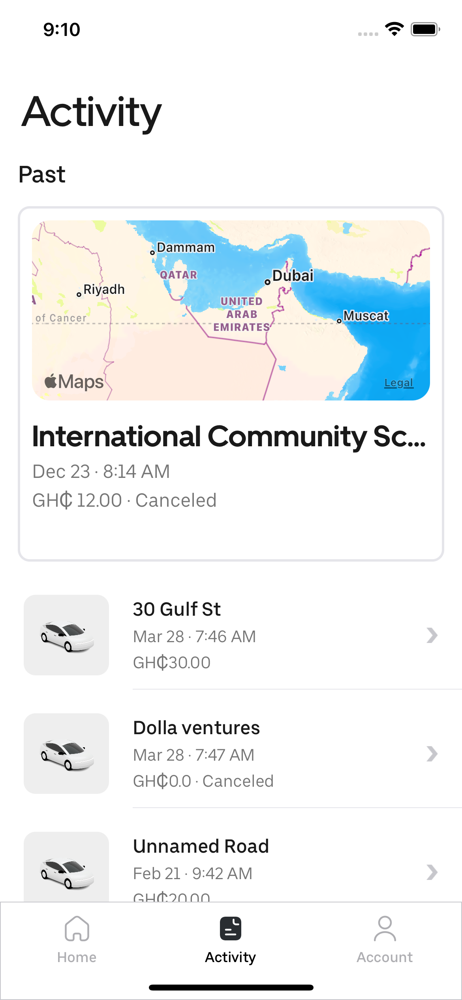
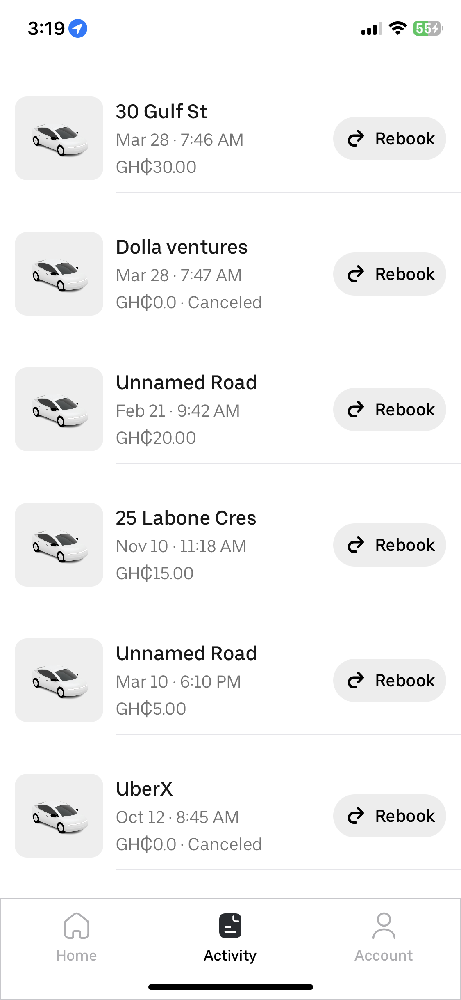
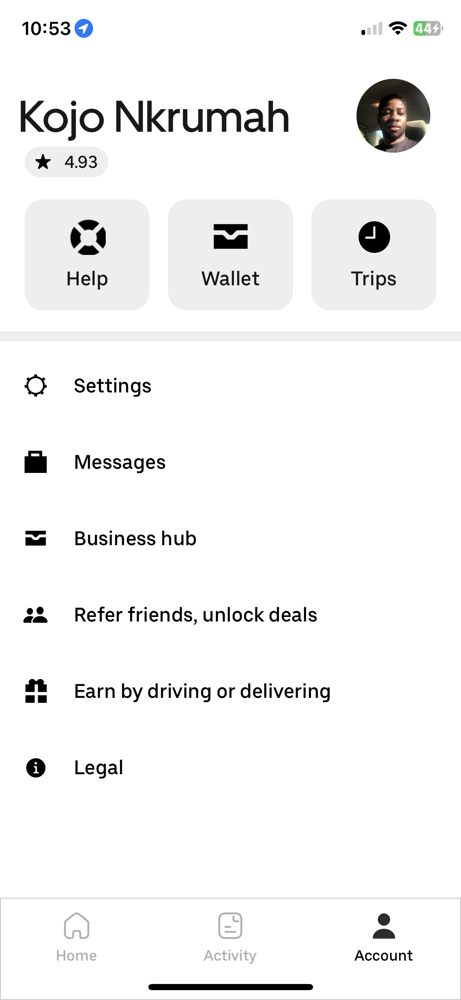

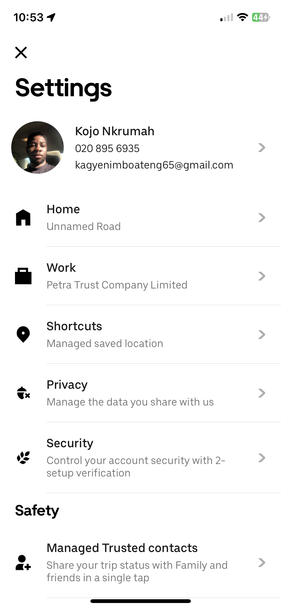
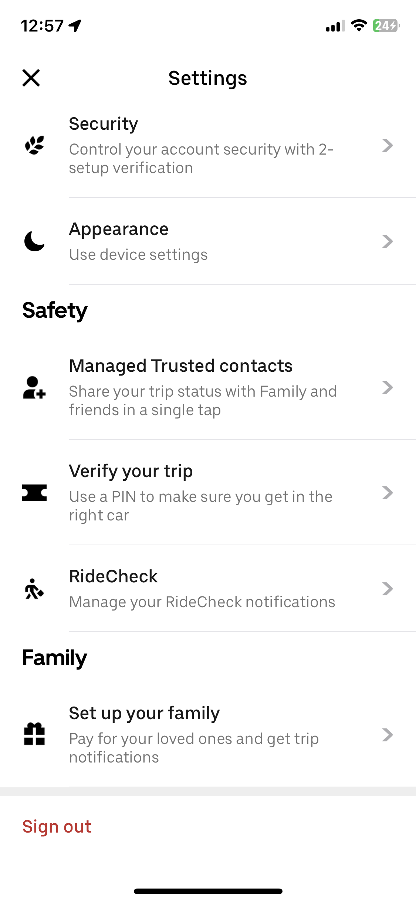
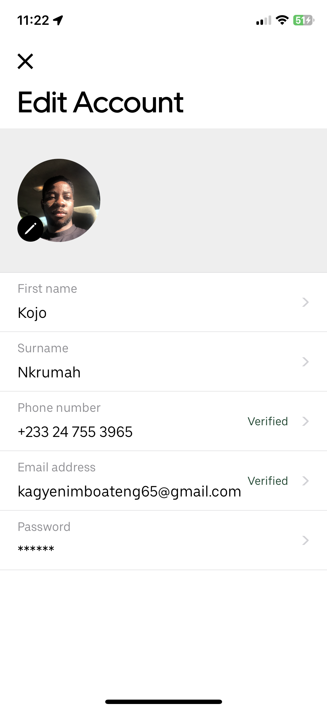

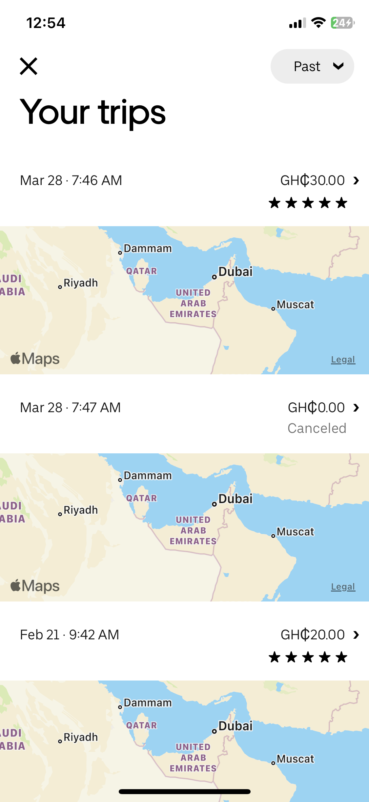
