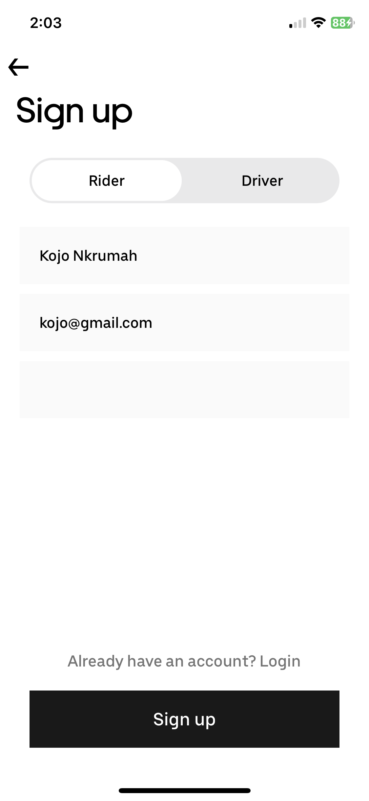
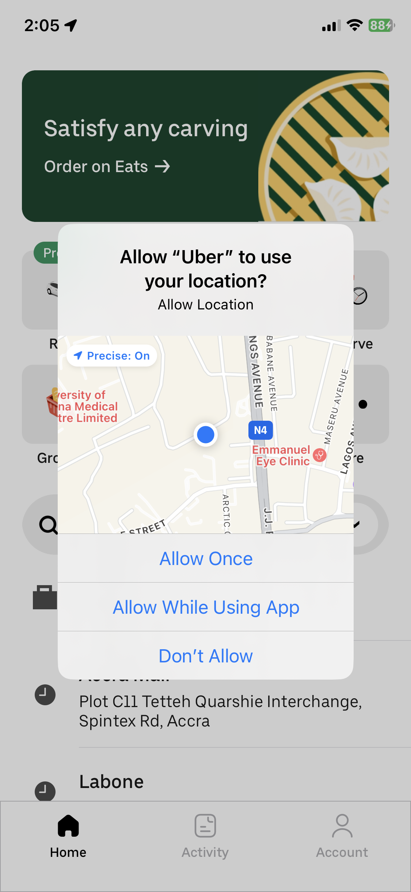
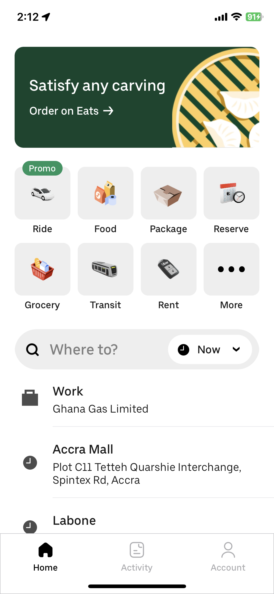
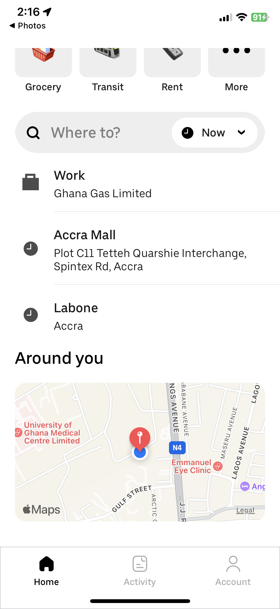
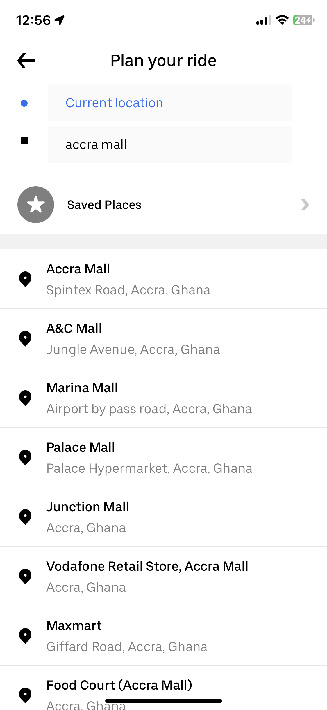
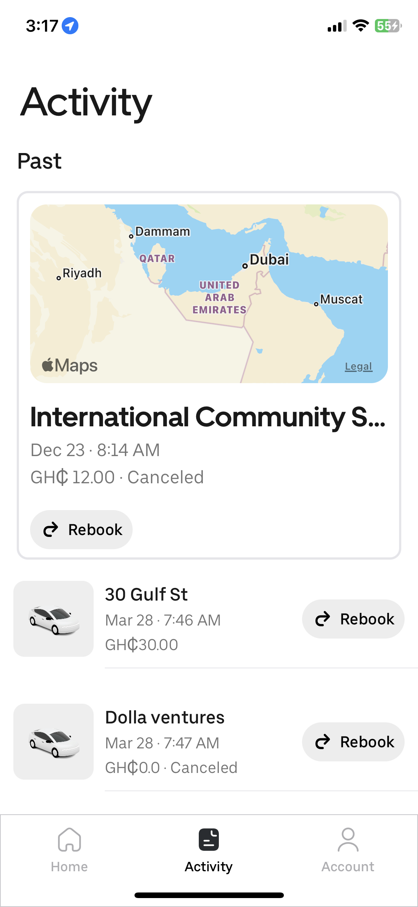
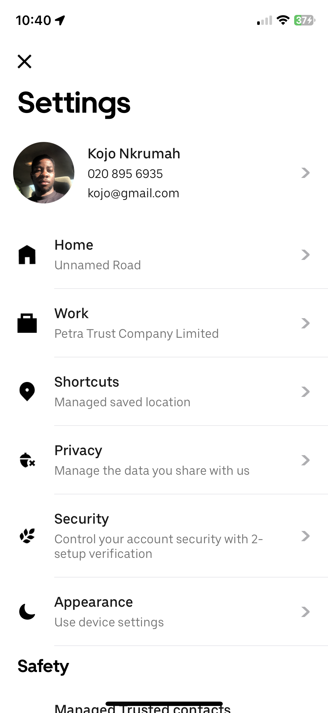

# Uber
This is a rebuild of the booking rides flow of Uber.
In this project, we take a deep dive into implementing Uber's complex UI, authenticating users & riders with Firebase and utilizing MapKit to show driver locations.

### Note ⚙️
The application was built using: 
* Xcode 14.3
* Swift 5.8

### Core Technologies 📲
* UIKit (Programmatic approach)
* Protocol Delegation
* Firebase Authentication
* Firebase RealTime Database
* MapKit
* Cosmos (third party)

# Screenshots

